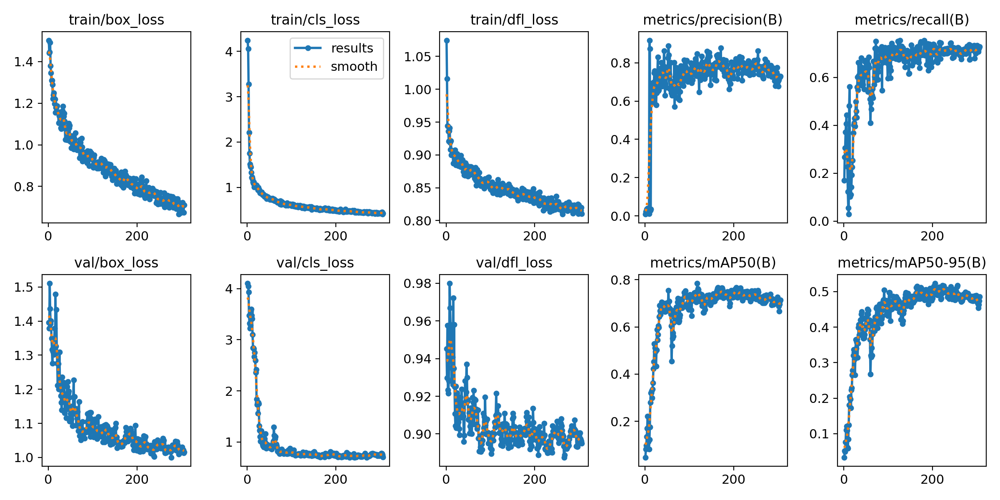
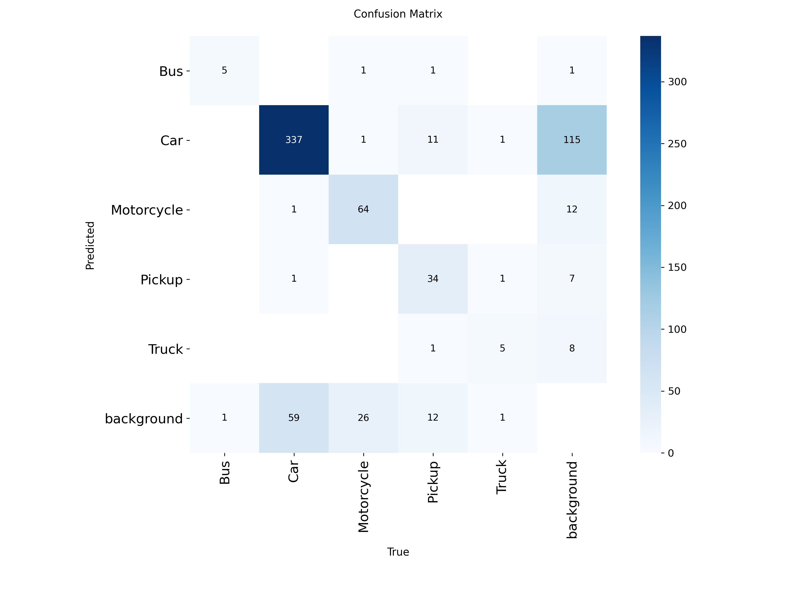
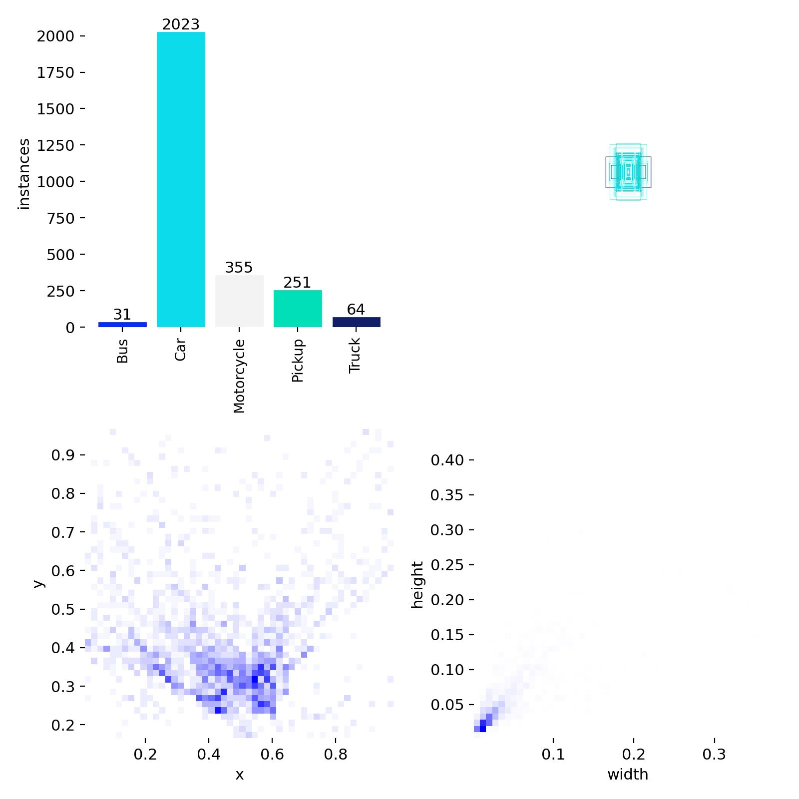
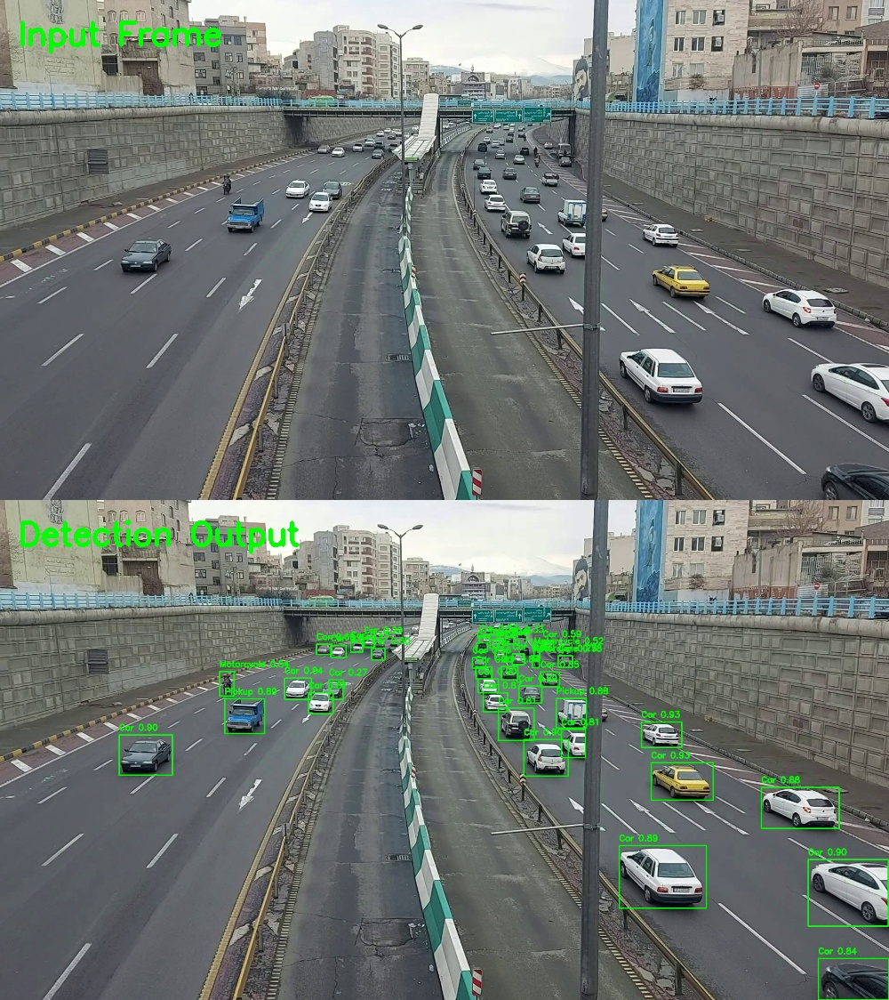
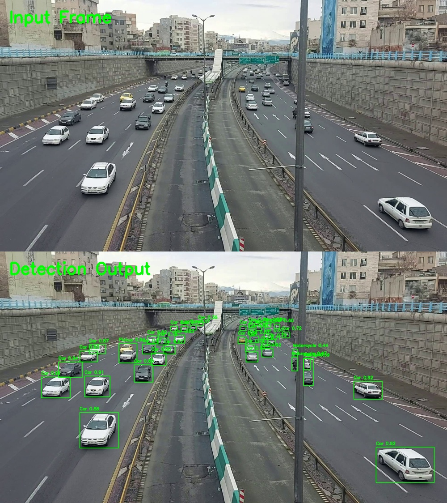
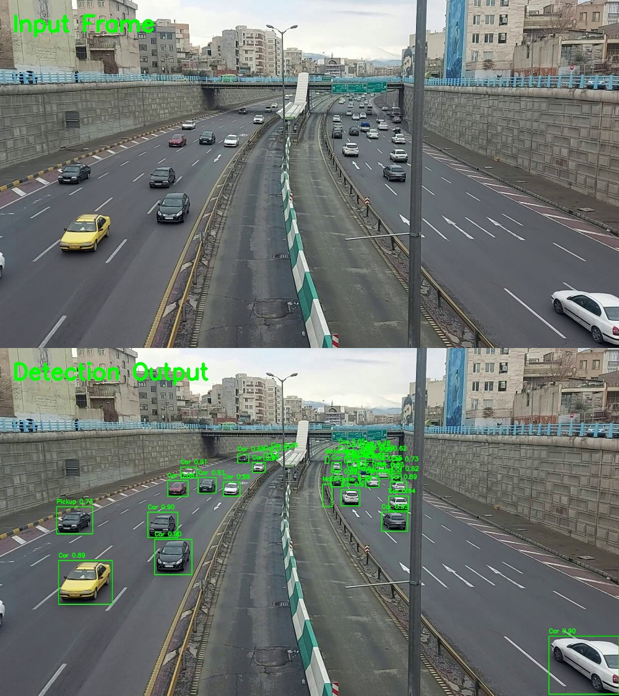

# Edge AI Vehicle Detection using YOLOv8 and ONNX Runtime

## Overview

This project implements a real-time multi-class vehicle detection system using **YOLOv8**, **ONNX Runtime**, and **INT8 quantization** for efficient edge deployment. The system processes traffic videos and generates annotated output videos with bounding boxes and confidence scores.

---

## Features

- Multi-class vehicle detection
- YOLOv8 fine-tuning using PyTorch
- ONNX model export
- Custom ONNX Runtime inference pipeline
- Video input → Annotated video output
- INT8 quantization support
- Latency benchmarking
- Real-time deployment pipeline

---

## Vehicle Classes

| ID | Class |
|----|--------|
| 0 | Bus |
| 1 | Car |
| 2 | Motorcycle |
| 3 | Pickup |
| 4 | Truck |

---

# Dataset

| Split | Images |
|---------|---------|
| Train | 136 |
| Validation | 28 |
| Total Classes | 5 |

---

# Model Architecture

- Model: **YOLOv8n**
- Parameters: **3.01 Million**
- Layers: **130**
- Compute: **8.2 GFLOPs**

```
Backbone
 ├── Conv
 ├── C2f
 └── SPPF

Neck
 ├── PAN-FPN

Head
 └── Detection Head (5 Classes)
```

---

# Training Configuration

| Parameter | Value |
|------------|------|
| Model | YOLOv8n |
| Epochs | 500 |
| Batch Size | 32 |
| Input Size | 640×640 |
| Optimizer | AdamW |
| Framework | Ultralytics YOLOv8 |
| GPU | NVIDIA GTX 1050 Ti (4GB) |
| CUDA | 12.1 |
| PyTorch | 2.5.1 |

---

# Training Performance

| Metric | Value |
|----------|------|
| Precision | 0.86 |
| Recall | 0.57 |
| mAP@50 | 0.70 |
| mAP@50-95 | 0.44 |

---

# Project Pipeline

```text
Traffic Dataset
        ↓
YOLOv8 Training
        ↓
best.pt
        ↓
ONNX Export
        ↓
best.onnx
        ↓
INT8 Quantization
        ↓
ONNX Runtime
        ↓
Video Inference
        ↓
Annotated Output Video
```

---

# Repository Structure

```
Edge-AI-Vehicle-Detection
│
├── README.md
├── requirements.txt
│
├── training
│   ├── train.py
│   └── data.yaml
│
├── deployment
│   ├── export_onnx.py
│   ├── detect_video_onnx.py
│   ├── quantize_model.py
│   └── benchmark.py
│
├── results
│   ├── results.png
│   ├── confusion_matrix.png
│   ├── labels.jpg
│   └── output_sample.jpg
│
├── screenshots
│   ├── original_frame.jpg
│   └── detected_frame.jpg
│
└── .gitignore
```

---

# Training

```python
from ultralytics import YOLO

model = YOLO("yolov8n.pt")

model.train(
    data="data.yaml",
    epochs=500,
    imgsz=640,
    batch=32,
    device=0
)
```

---

# Export to ONNX

```python
from ultralytics import YOLO

model = YOLO("best.pt")

model.export(format="onnx")
```

---

# Video Inference

```python
python detect_video_onnx.py
```

Input:

```
input.mp4
```

Output:

```
output.mp4
```

---

# Results

## Training Curves

<p align="center">

</p>

## Confusion Matrix

<p align="center">

</p>

## Label Distribution

<p align="center">

</p>

---

# Detection Examples

## Example 1

<p align="center">

</p>

## Example 2

<p align="center">

</p>

## Example 3

<p align="center">

</p>

---

# Technologies Used

- Python
- PyTorch
- Ultralytics YOLOv8
- ONNX
- ONNX Runtime
- OpenCV
- NumPy

---

# Hardware Used

```text
CUDA     : 12.1
Python   : 3.11
PyTorch  : 2.5.1
```

---

# Applications

- Smart Traffic Monitoring
- Intelligent Transportation Systems
- Edge AI Deployment
- Embedded Computer Vision
- Autonomous Vehicle Perception

---

# Future Work

- Vehicle Tracking using ByteTrack
- Vehicle Counting
- INT8 Quantization Benchmarking
- TensorRT Acceleration
- Deployment on Embedded Platforms
- Traffic Analytics Dashboard

---
